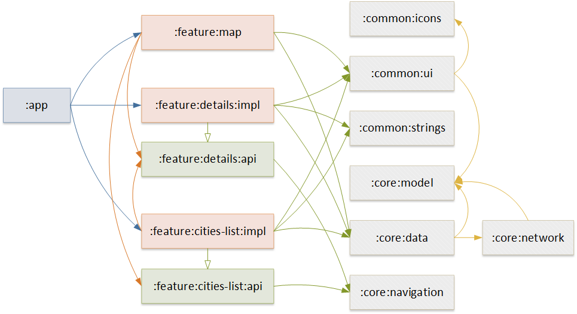

# Weather App

-   [What is it?](#what-is-it)
-   [Screenshots](#screenshots)
-   [Get APK](#get-apk)
-   [Current Tech Stack](#current-tech-stack)
    -   [Modules graph](#modules-graph)
-   [How to build the project?](#how-to-build-the-project)
    -   [Get OpenWeather API key](#get-openweather-api-key)
    -   [Specify API key in build properties](#specify-api-key-in-build-properties)

## What is it?

This is **my test project** for my first job **in 2019** 🤓

👨🏻‍💻 In 2024, I decided to rewrite this shit. It's still shit, but with less smell.

## Screenshots


## Get APK

[](https://github.com/DaniilPavlenko/weather/releases)

## Current Tech Stack

-   Presentation layer based on MVVM, Single Activity, Fragments, Android Views.
-   Some kind of Clean architecture.
-   Modularization.
-   DI - Hilt.
-   Network - Retrofit.
-   Serialization - GSON.
-   Map - OSMDroid.
-   Material2 Design.
-   Version Catalog.
-   Convention Plugins.

### Modules graph



## How to build the project?

### Get OpenWeather API key

⚠️ To call OpenWeather API get key [here](https://home.openweathermap.org/api_keys) for free.

### Specify API key in build properties

To build the project provide your API key to OpenWeather API in the root `local.properties` file
with `openweather.apikey` property.

```properties
# in your root local.properties
openweather.apikey=YOUR_KEY
```
